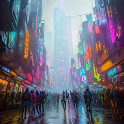

# 多模态输入输出学习

该项目是在多模态大模型探索过程中的一些尝试，用于学习和认识多模态模型。

## 运行环境

安装pytorch并使用pip install 安装 requirements.txt

```shell
pip install torch==2.1.2 torchvision==0.16.2 torchaudio==2.1.2 --index-url https://download.pytorch.org/whl/cu121
pip install -r requirements.txt
```

## 效果

|输入|输出|
| ------ | ------- |
| | |
| | | 
|画一张赛博朋克风格的城市，前景是丰富的人物，背景是高楼大厦 |    |
|   | 这是一张展示两位徒步旅行者在自然风光中的户外活动的照片。前景中，一位穿着蓝色上衣和深色裤子的人正背对着镜头行走，而另一位穿着黑色夹克和浅色裤子的人则面向相机方向站立。他们周围是郁郁葱葱的树木、多彩的野花以及远处连绵起伏的山脉。整个场景被柔和的阳光照亮，营造出一种宁静和谐的氛围。 |